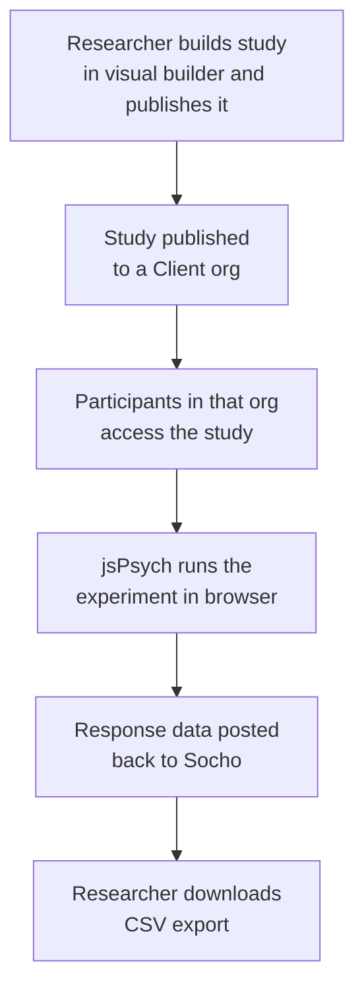
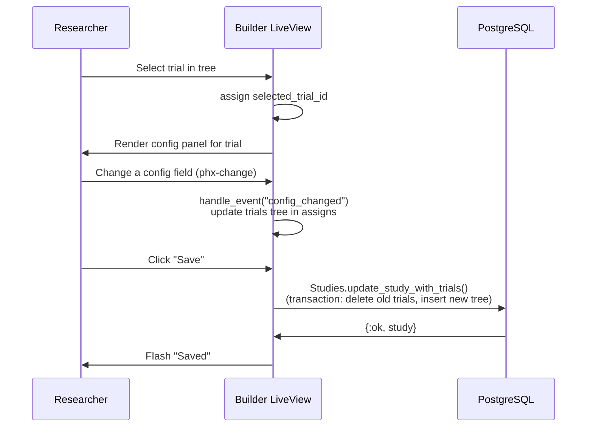
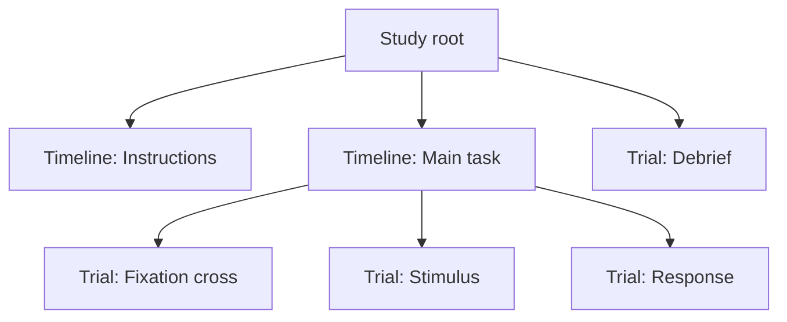
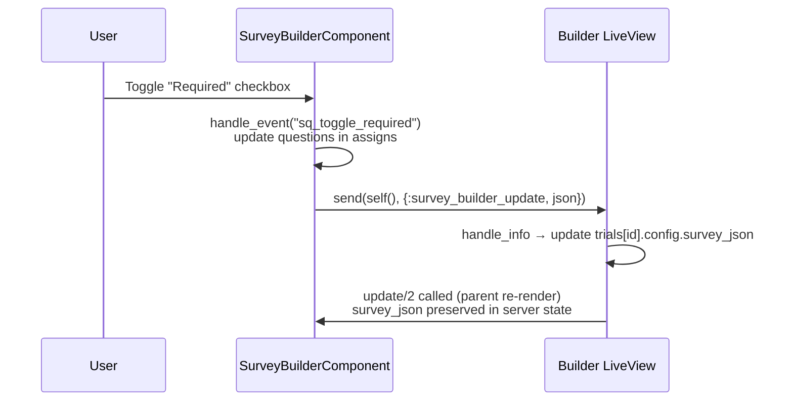
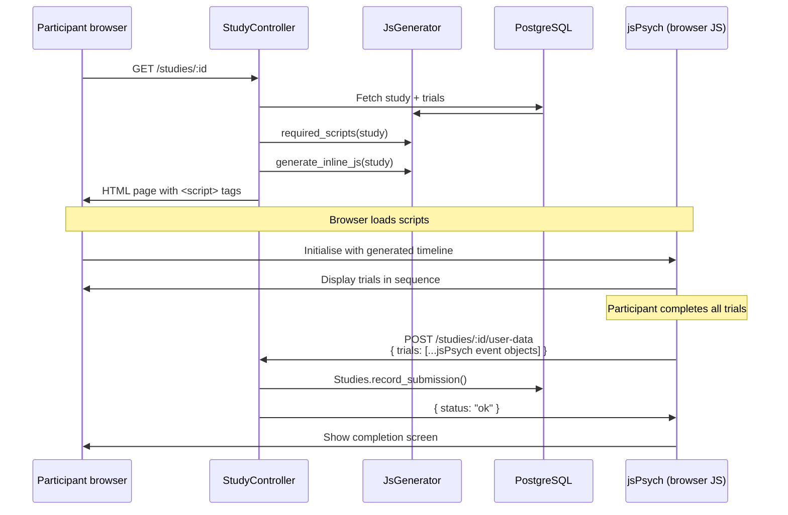
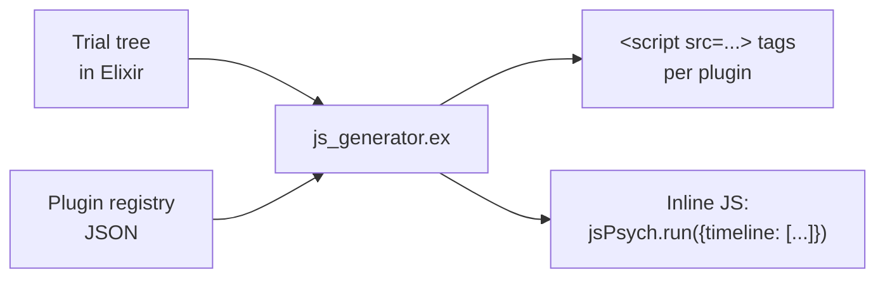
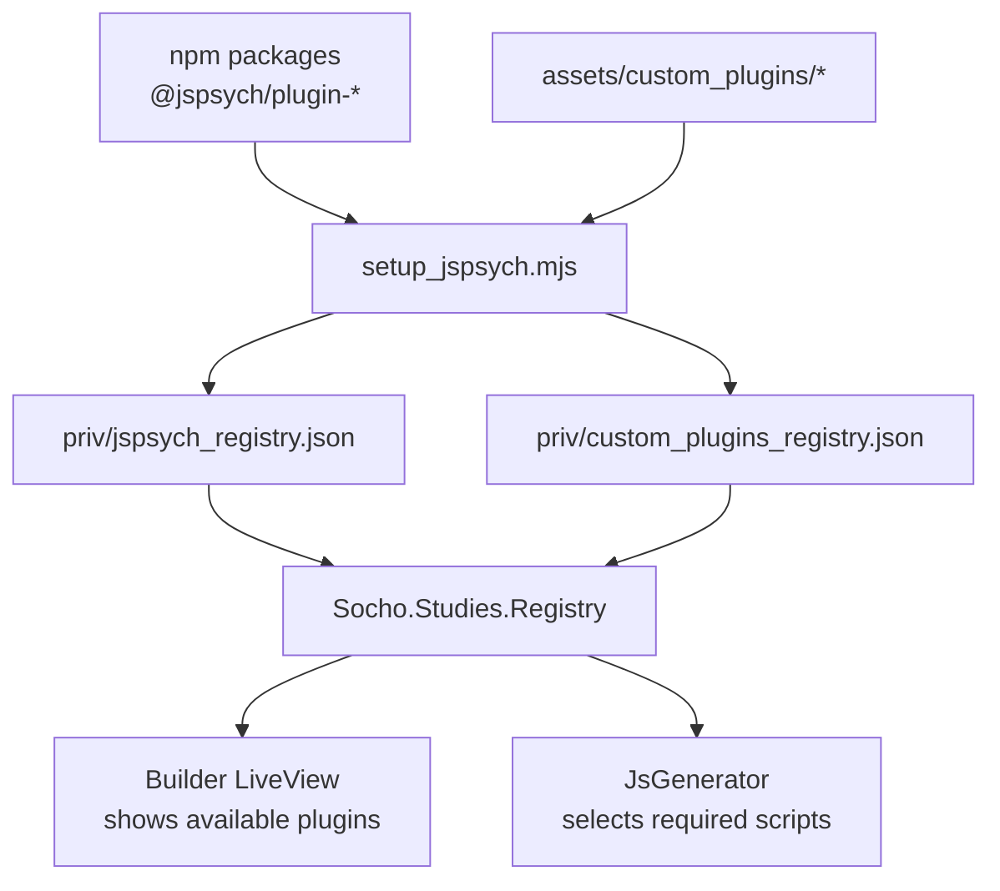
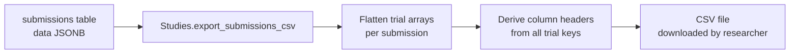

# Overview 
Socho is a platform for creating and distributing **behavioral research studies** online. Researchers (admins and managers) use a visual builder to compose study experiments from modular trial blocks. Participants access published studies, complete them in the browser, and their response data is recorded for export and analysis.

The platform is built around the **jsPsych** JavaScript framework — a widely used library for running behavioral experiments in the browser. Socho provides the no-code builder, participant management, data collection, and multi-tenancy on top of it.

## Typical Workflow




## Key Features and their Implementation Details

### Study Builder

The builder is a Phoenix LiveView (`builder.ex`) that gives researchers a three-column layout: trial tree on the left, config panel in the middle, and a live preview on the right.

#### Data Flow — Editing a Trial



#### Trial Tree Structure

Trials are stored flat in the database with a `parent_id` column. When loaded, they are assembled into a nested tree in memory. The builder works on this in-memory tree and writes it back on save.


caption : sample trial structure

#### Survey Builder Component

Survey-type trials (survey text, survey likert) have a richer editor provided by `SurveyBuilderComponent` (a LiveComponent). It maintains its own question list in state and synchronises with the parent builder via a `notify_parent` message pattern — it never submits the survey JSON as a form field.



#### Live Preview

The builder can render the study inline without saving. `JsGenerator.generate_inline_js/1` builds a full jsPsych script from the current in-memory trial tree and injects it into an iframe. The iframe uses `?preview=true` which suppresses data submission.

---

### Study Participation

Participants access studies through a conventional HTTP controller (`StudyController`), not LiveView. The page is a minimal HTML shell; jsPsych owns the entire page once loaded.

#### Sequence Diagram — Taking a Study



#### JS Generation

`JsGenerator` (`lib/socho/studies/js_generator.ex`) translates the trial tree into jsPsych JavaScript:



Each trial node becomes a jsPsych timeline entry. Timelines, loops, and conditional skip logic (`skip_unless`) are translated to jsPsych's `conditional_function` and `loop_function` options.

---

### Plugin & Registry System

jsPsych plugins are the building blocks for trials. Socho loads plugin metadata from two sources at build time and makes it available to the builder at runtime.

#### Build-time Registry Generation



#### Plugin Metadata

Each plugin entry in the registry describes its parameters:

```json
{
  "survey-likert": {
    "name": "survey-likert",
    "parameters": {
      "questions":   { "type": "COMPLEX", "array": true },
      "scale_width": { "type": "INT" },
      "randomize_question_order": { "type": "BOOL" }
    }
  }
}
```

The builder reads these parameters and dynamically renders the correct input widget for each type (`INT` → number input, `BOOL` → checkbox, `HTML_STRING` → rich text editor, etc.).

#### Adding a Custom Plugin

1. Create a directory under `assets/custom_plugins/<plugin-name>/`
2. Add an `index.js` exporting a jsPsych plugin and a `registry.json` describing its parameters
3. Run `mix assets.setup` to regenerate `custom_plugins_registry.json`
4. The plugin appears automatically in the builder

---


### Data Export

After a study runs, submissions are stored as raw jsPsych event arrays. Socho can export them as a flat CSV.



Each row in the CSV is one submission. Columns are derived from the union of all jsPsych event keys across all submissions (e.g. `rt`, `response`, `stimulus`, `trial_type`). Trial-level columns are prefixed by trial index when a submission has multiple trials.

---

