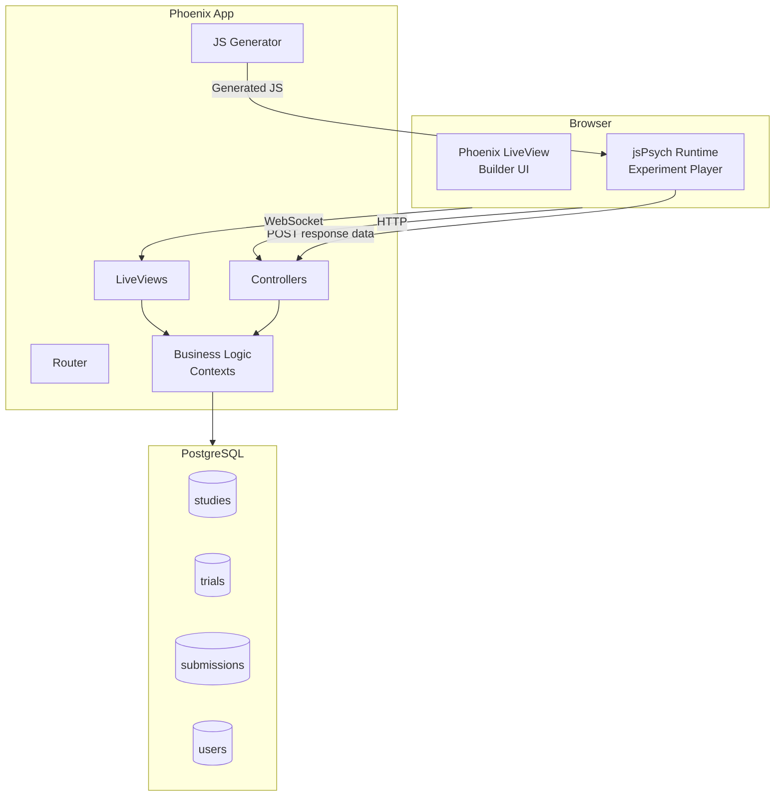
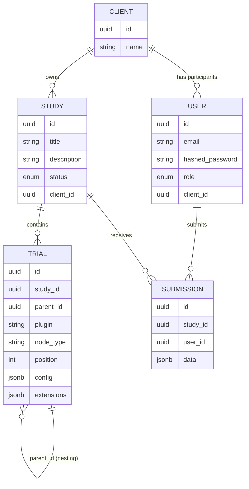

# System Design 

## Tech Stack

| Layer | Technology |
|-------|-----------|
| Language | Elixir ~> 1.15 |
| Web framework | Phoenix 1.8 |
| Real-time UI | Phoenix LiveView ~> 1.1 |
| Database | PostgreSQL (via Ecto) |
| CSS | Tailwind CSS v4 |
| JS bundler | esbuild |
| Experiment runtime | jsPsych (npm) |
| Rich text editing | TipTap (in survey builder) |
| Authentication | bcrypt + session tokens |
| Email | Swoosh |

---

## Architecture Overview

Socho follows a standard Phoenix layered architecture with LiveView for the interactive builder UI. The study execution layer is entirely client-side jsPsych — Socho generates the JavaScript from user configured studies, serves it, and collects results.



---

## Domain Model



### Key entities

**User** — Has one of three roles: `admin`, `manager`, or `participant`. Managers and participants are scoped to a `Client` organisation.

**Client** — An organisation/tenant. Participants belong to a client and can only take studies published for that client.

**Study** — A research experiment. Has a `status` of `draft` or `published`. Contains an ordered tree of `Trial` nodes.

**Trial** — A single task or container. The `plugin` field names the jsPsych plugin to use (e.g. `"survey-likert"`). The `config` JSONB field stores plugin parameters. `node_type` is one of:

| node_type | Description |
|-----------|-------------|
| `trial` | A single jsPsych task |
| `timeline` | A container that groups child trials and can set timeline variables, repetitions, or loop functions |
| `counterbalanced_group` | Randomises the order of child timelines across participants |
| `template_group` | A reusable preset defined in code (not persisted as individual children) |

**Submission** — One per (study, participant) pair. The `data` field holds the raw jsPsych event array.

---

## Directory Structure

```
socho/
├── assets/
│   ├── css/                        Tailwind styles
│   ├── js/
│   │   ├── app.js                  LiveView setup, hook registration
│   │   └── sortable_hook.js        Drag-drop for trial tree
│   ├── custom_plugins/             Custom jsPsych plugins
│   │   ├── example-rating/
│   │   ├── image-swipe/
│   │   └── multi-image-select/
│   └── setup_jspsych.mjs           Build script: generates plugin registries
│
├── config/                         Phoenix configuration
├── lib/
│   ├── socho/                      Business logic (contexts & schemas)
│   │   ├── accounts/               Users, sessions, auth
│   │   ├── clients/                Client organisations
│   │   ├── studies/
│   │   │   ├── study.ex
│   │   │   ├── trial.ex
│   │   │   ├── submission.ex
│   │   │   ├── registry.ex         Plugin metadata loader
│   │   │   ├── js_generator.ex     Generates jsPsych JS from trial tree
│   │   │   ├── templates.ex        Pre-built study templates
│   │   │   └── studies.ex          Main context (queries, save, export)
│   │   └── app_settings/
│   │
│   └── socho_web/                  Web layer
│       ├── controllers/
│       │   ├── study_controller.ex Study player + data submission endpoint
│       │   └── user_session_controller.ex
│       ├── live/
│       │   ├── study_live/
│       │   │   ├── builder.ex      Visual study builder (LiveView)
│       │   │   ├── builder_components.ex
│       │   │   ├── survey_builder_component.ex
│       │   │   ├── dashboard.ex    Participant study list
│       │   │   ├── index.ex        Admin study list
│       │   │   └── settings.ex     Study metadata editor
│       │   └── user_live/
│       ├── components/             Reusable HEEx components
│       ├── user_auth.ex            Auth plugs
│       └── router.ex
│
└── priv/
    ├── jspsych_registry.json       Auto-generated (npm plugins)
    ├── custom_plugins_registry.json Auto-generated (custom plugins)
    └── repo/migrations/
```

---

