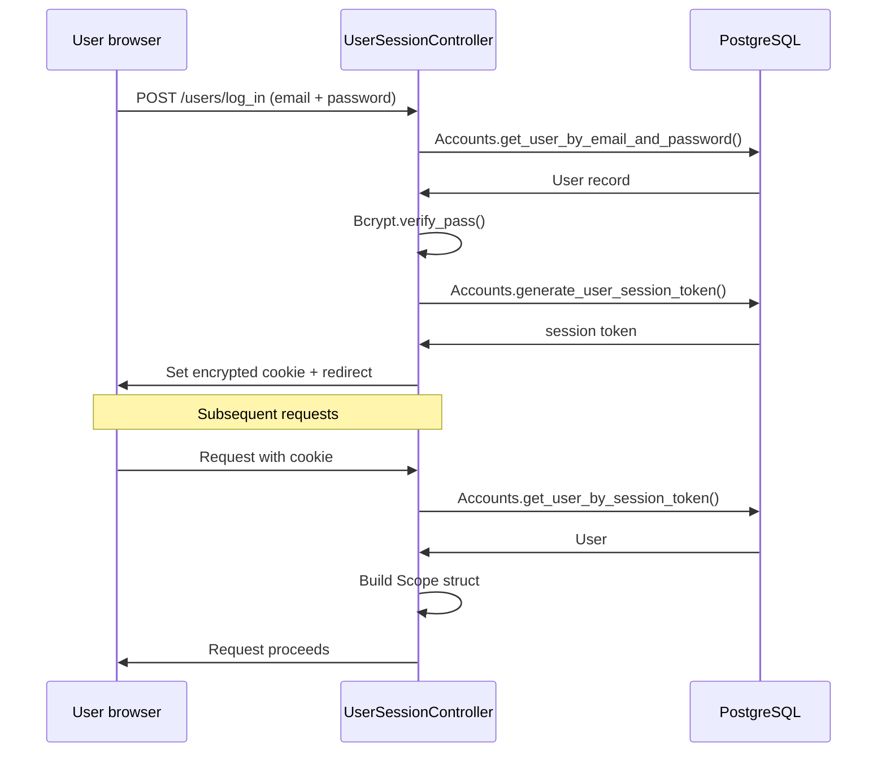
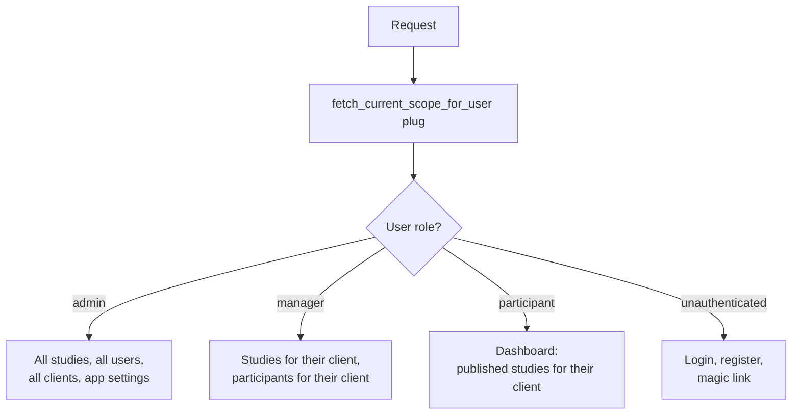
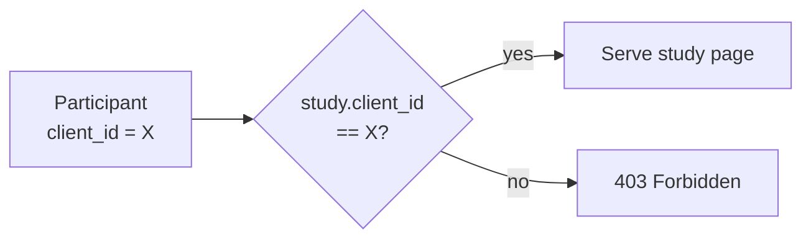

# Authentication & Authorization

## Authentication Flow

## Role-Based Access

There are three roles. Every request passes through a `Scope` struct that carries the current user and their client context.

## Study Access Guard

When a participant loads a study, `StudyController` verifies their client matches the study's client before serving the page:

---
