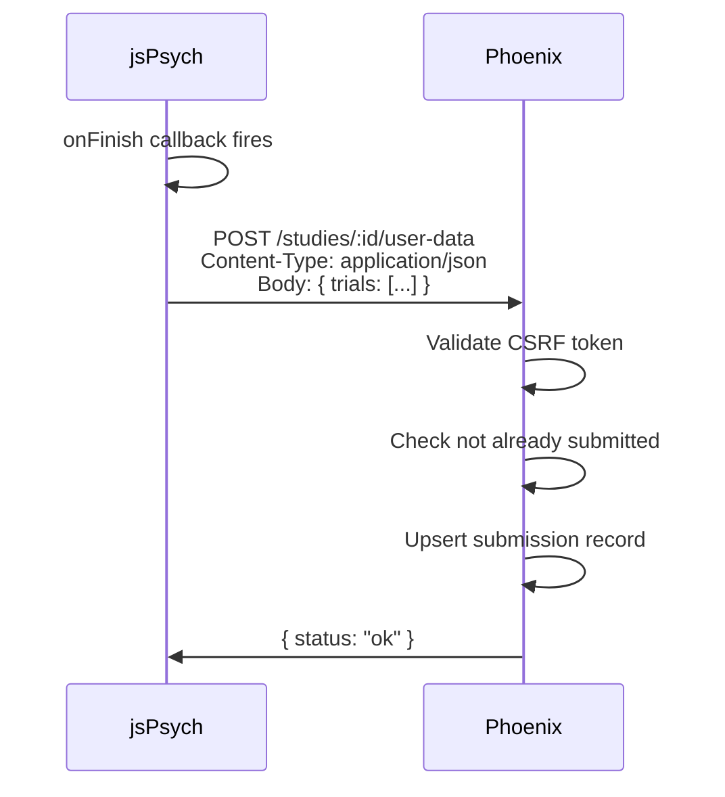

# Frontend & JavaScript Interop

## LiveView Hooks

Hooks connect DOM elements to JavaScript behaviour while letting the server stay in control of state. The main hooks in use:

| Hook | File | Purpose |
|------|------|---------|
| `Sortable` | `sortable_hook.js` | Drag-and-drop reordering of trials in the builder tree |
| `.SurveyHtml` | (colocated in component) | TipTap rich text editor for survey question titles; pushes `sq_update_field` events to the server on blur |

## phx-update="ignore"

The TipTap editor elements use `phx-update="ignore"` so LiveView does not overwrite the editor's DOM on re-renders. The editor is initialised once by the hook and manages its own DOM. Data flows back to the server via `phx-hook` push events, not by LiveView patching the element.

## jsPsych ↔ Socho Communication

jsPsych runs completely independently of LiveView. The only communication between jsPsych and the Phoenix backend is a single HTTP POST at the end of the study:

