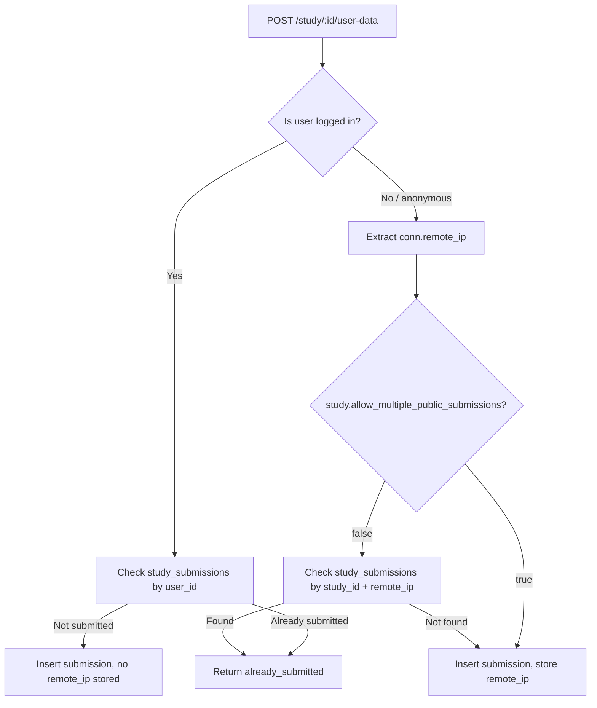

# IP-Based Submission Gating

## Overview

Public surveys (those accessed without a login) normally allow unlimited submissions from any visitor. This feature lets a study designer restrict public surveys so that each IP address can only submit once.

This is an intentionally imperfect safeguard — see the [Limitations](#limitations) section — but it meaningfully reduces casual duplicate submissions.

## How It Works

### The Setting

Each `Study` has a boolean field `allow_multiple_public_submissions` (default: `true`). A designer toggles this off in **Study Settings** to enable IP gating.

### Submission Flow

The controller (`StudyController.save_data/2`) handles this logic:

1. `conn.remote_ip` is always extracted and formatted to a string via `:inet.ntoa/1` (handles both IPv4 and IPv6).
2. For **logged-in users**, the existing `has_submitted?/2` query on `(study_id, user_id)` is used — IP plays no role.
3. For **anonymous users**:
   - If `allow_multiple_public_submissions` is `true` → submission is accepted without any duplicate check.
   - If `false` → `has_submitted_from_ip?/2` queries `study_submissions` for a row matching `(study_id, remote_ip)`. If found, the request is rejected with `{"status": "already_submitted"}`.
4. `remote_ip` is stored on every submission (logged-in or anonymous) for audit purposes.

### Database

`study_submissions` gains a nullable `remote_ip` string column. It is `null` for submissions created before this feature shipped, and populated for all new ones.

`studies` gains `allow_multiple_public_submissions boolean NOT NULL DEFAULT true`, so all existing studies are unaffected until a designer explicitly opts in.

### Key Files

| File | Role |
|---|---|
| `lib/socho/studies/study.ex` | Schema field + changeset cast |
| `lib/socho/studies/submission.ex` | Schema field + changeset cast |
| `lib/socho/studies.ex` | `record_submission/4`, `has_submitted?/2`, `has_submitted_from_ip?/2` |
| `lib/socho_web/controllers/study_controller.ex` | `save_data/2` — orchestrates the check |
| `lib/socho_web/live/study_live/settings.ex` | Toggle UI in Study Settings |
| `priv/repo/migrations/20260904000000_*` | Adds `allow_multiple_public_submissions` to studies |
| `priv/repo/migrations/20260904000001_*` | Adds `remote_ip` to study_submissions |

## Limitations

**IP is a weak identifier.** This is a speed bump, not a wall:

- **Shared IPs** — Users behind corporate NAT, university networks, or mobile carrier proxies all appear as the same IP. Blocking one blocks all of them.
- **VPNs / proxies** — Any user can bypass the check by switching VPN server.
- **Dynamic IPs** — A user whose IP changes (common on mobile) can resubmit.
- **No retroactive enforcement** — Submissions recorded before this feature was enabled have no `remote_ip`. Turning on IP gating for a live study will not block someone who already submitted under the old behaviour.

The settings UI surfaces this caveat to the designer so they can make an informed decision.

## Preview Mode

Preview mode (`?preview=true`) bypasses all submission logic entirely — the response is never sent to the server. IP gating therefore has no effect during preview.
