# System Design — Socho

This document is for developers new to the Socho codebase. It covers what the platform does, how it is structured, and how the main features work end-to-end.

---

## Table of Contents

1. [What is Socho?](#what-is-socho)
2. [Tech Stack](#tech-stack)
3. [Architecture Overview](#architecture-overview)
4. [Domain Model](#domain-model)
5. [Directory Structure](#directory-structure)
6. [Key Features](#key-features)
   - [Study Builder](#study-builder)
   - [Study Participation](#study-participation)
   - [Plugin & Registry System](#plugin--registry-system)
   - [Authentication & Authorization](#authentication--authorization)
   - [Data Export](#data-export)
7. [Frontend & JavaScript Interop](#frontend--javascript-interop)

---

## What is Socho?

Socho is a platform for creating and distributing **behavioral research studies** online. Researchers (admins and managers) use a visual builder to compose study experiments from modular trial blocks. Participants access published studies, complete them in the browser, and their response data is recorded for export and analysis.

The platform is built around the **jsPsych** JavaScript framework — a widely used library for running behavioral experiments in the browser. Socho provides the no-code builder, participant management, data collection, and multi-tenancy on top of it.

**Typical workflow:**


---

## Tech Stack

| Layer | Technology |
|-------|-----------|
| Language | Elixir ~> 1.15 |
| Web framework | Phoenix 1.8 |
| Real-time UI | Phoenix LiveView ~> 1.1 |
| Database | PostgreSQL (via Ecto) |
| CSS | Tailwind CSS v4 |
| JS bundler | esbuild |
| Experiment runtime | jsPsych (npm) |
| Rich text editing | TipTap (in survey builder) |
| Authentication | bcrypt + session tokens |
| Email | Swoosh |

---

## Architecture Overview

Socho follows a standard Phoenix layered architecture with LiveView for the interactive builder UI. The study execution layer is entirely client-side jsPsych — Socho generates the JavaScript, serves it, and collects results.

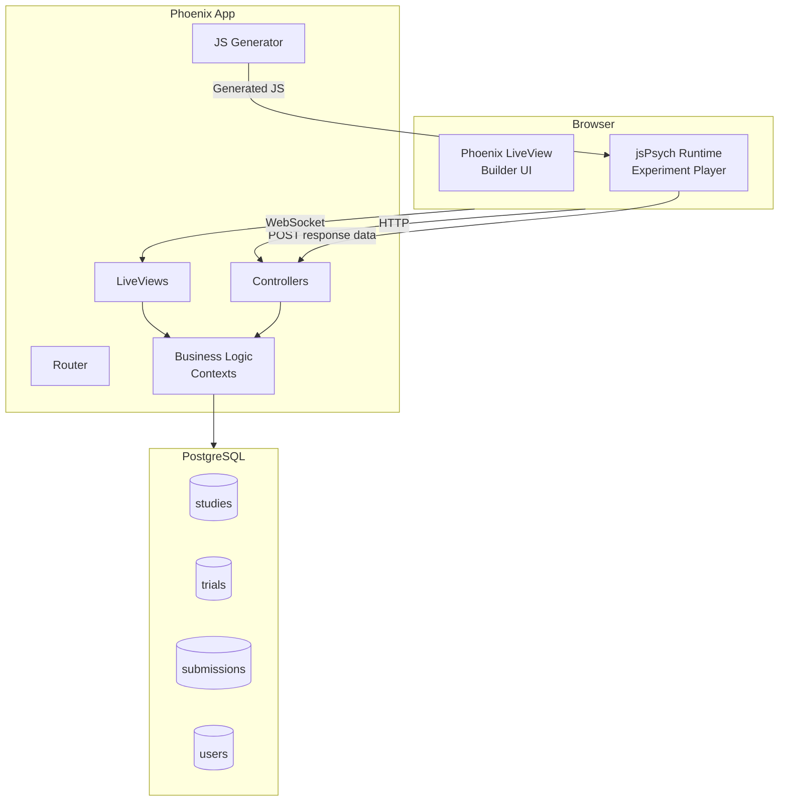

---

## Domain Model

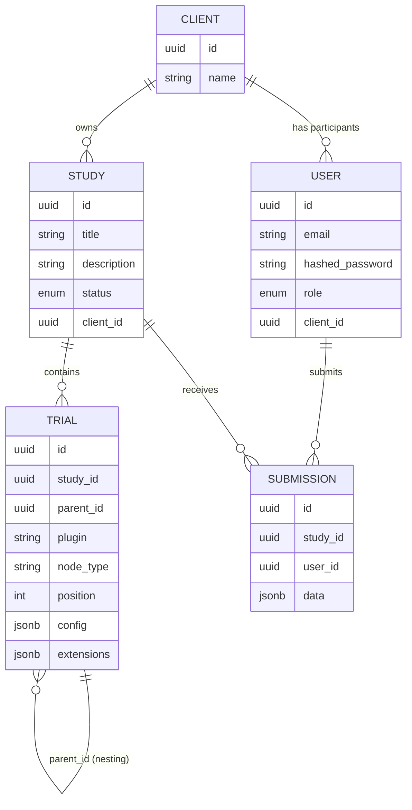

### Key entities

**User** — Has one of three roles: `admin`, `manager`, or `participant`. Managers and participants are scoped to a `Client` organisation.

**Client** — An organisation/tenant. Participants belong to a client and can only take studies published for that client.

**Study** — A research experiment. Has a `status` of `draft` or `published`. Contains an ordered tree of `Trial` nodes.

**Trial** — A single task or container. The `plugin` field names the jsPsych plugin to use (e.g. `"survey-likert"`). The `config` JSONB field stores plugin parameters. `node_type` is one of:

| node_type | Description |
|-----------|-------------|
| `trial` | A single jsPsych task |
| `timeline` | A container that groups child trials and can set timeline variables, repetitions, or loop functions |
| `counterbalanced_group` | Randomises the order of child timelines across participants |
| `template_group` | A reusable preset defined in code (not persisted as individual children) |

**Submission** — One per (study, participant) pair. The `data` field holds the raw jsPsych event array.

---

## Directory Structure

```
socho/
├── assets/
│   ├── css/                        Tailwind styles
│   ├── js/
│   │   ├── app.js                  LiveView setup, hook registration
│   │   └── sortable_hook.js        Drag-drop for trial tree
│   ├── custom_plugins/             Custom jsPsych plugins
│   │   ├── example-rating/
│   │   ├── image-swipe/
│   │   └── multi-image-select/
│   └── setup_jspsych.mjs           Build script: generates plugin registries
│
├── config/                         Phoenix configuration
├── lib/
│   ├── socho/                      Business logic (contexts & schemas)
│   │   ├── accounts/               Users, sessions, auth
│   │   ├── clients/                Client organisations
│   │   ├── studies/
│   │   │   ├── study.ex
│   │   │   ├── trial.ex
│   │   │   ├── submission.ex
│   │   │   ├── registry.ex         Plugin metadata loader
│   │   │   ├── js_generator.ex     Generates jsPsych JS from trial tree
│   │   │   ├── templates.ex        Pre-built study templates
│   │   │   └── studies.ex          Main context (queries, save, export)
│   │   └── app_settings/
│   │
│   └── socho_web/                  Web layer
│       ├── controllers/
│       │   ├── study_controller.ex Study player + data submission endpoint
│       │   └── user_session_controller.ex
│       ├── live/
│       │   ├── study_live/
│       │   │   ├── builder.ex      Visual study builder (LiveView)
│       │   │   ├── builder_components.ex
│       │   │   ├── survey_builder_component.ex
│       │   │   ├── dashboard.ex    Participant study list
│       │   │   ├── index.ex        Admin study list
│       │   │   └── settings.ex     Study metadata editor
│       │   └── user_live/
│       ├── components/             Reusable HEEx components
│       ├── user_auth.ex            Auth plugs
│       └── router.ex
│
└── priv/
    ├── jspsych_registry.json       Auto-generated (npm plugins)
    ├── custom_plugins_registry.json Auto-generated (custom plugins)
    └── repo/migrations/
```

---

## Key Features

### Study Builder

The builder is a Phoenix LiveView (`builder.ex`) that gives researchers a three-column layout: trial tree on the left, config panel in the middle, and a live preview on the right.

#### Data Flow — Editing a Trial

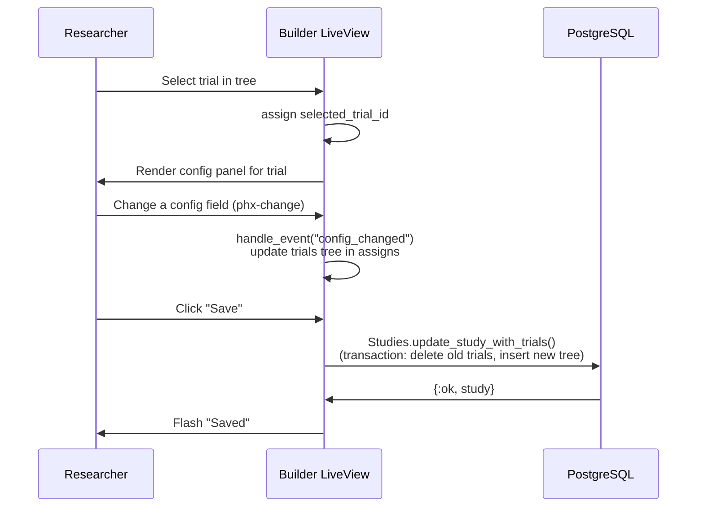

#### Trial Tree Structure

Trials are stored flat in the database with a `parent_id` column. When loaded, they are assembled into a nested tree in memory. The builder works on this in-memory tree and writes it back on save.

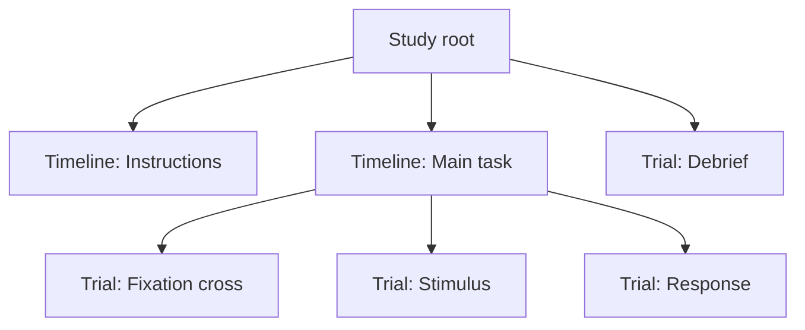

#### Survey Builder Component

Survey-type trials (survey text, survey likert) have a richer editor provided by `SurveyBuilderComponent` (a LiveComponent). It maintains its own question list in state and synchronises with the parent builder via a `notify_parent` message pattern — it never submits the survey JSON as a form field.

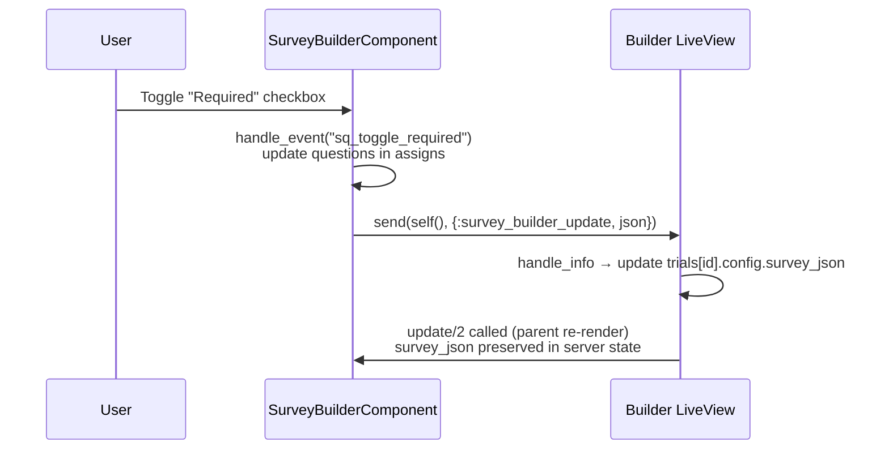

#### Live Preview

The builder can render the study inline without saving. `JsGenerator.generate_inline_js/1` builds a full jsPsych script from the current in-memory trial tree and injects it into an iframe. The iframe uses `?preview=true` which suppresses data submission.

---

### Study Participation

Participants access studies through a conventional HTTP controller (`StudyController`), not LiveView. The page is a minimal HTML shell; jsPsych owns the entire page once loaded.

#### Sequence Diagram — Taking a Study

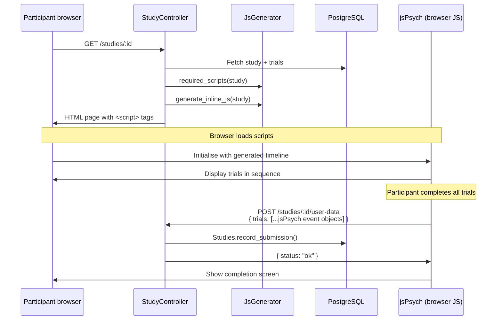

#### JS Generation

`JsGenerator` (`lib/socho/studies/js_generator.ex`) translates the trial tree into jsPsych JavaScript:

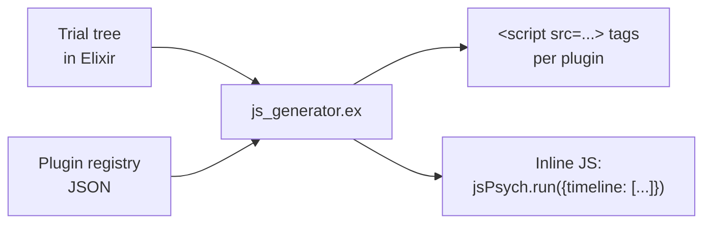

Each trial node becomes a jsPsych timeline entry. Timelines, loops, and conditional skip logic (`skip_unless`) are translated to jsPsych's `conditional_function` and `loop_function` options.

---

### Plugin & Registry System

jsPsych plugins are the building blocks for trials. Socho loads plugin metadata from two sources at build time and makes it available to the builder at runtime.

#### Build-time Registry Generation

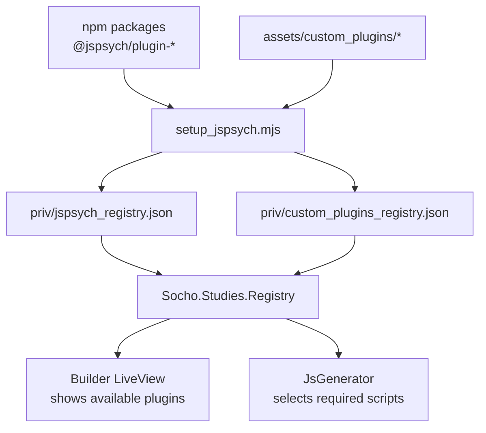

#### Plugin Metadata

Each plugin entry in the registry describes its parameters:

```json
{
  "survey-likert": {
    "name": "survey-likert",
    "parameters": {
      "questions":   { "type": "COMPLEX", "array": true },
      "scale_width": { "type": "INT" },
      "randomize_question_order": { "type": "BOOL" }
    }
  }
}
```

The builder reads these parameters and dynamically renders the correct input widget for each type (`INT` → number input, `BOOL` → checkbox, `HTML_STRING` → rich text editor, etc.).

#### Adding a Custom Plugin

1. Create a directory under `assets/custom_plugins/<plugin-name>/`
2. Add an `index.js` exporting a jsPsych plugin and a `registry.json` describing its parameters
3. Run `mix assets.setup` to regenerate `custom_plugins_registry.json`
4. The plugin appears automatically in the builder

---

### Authentication & Authorization

#### Authentication Flow

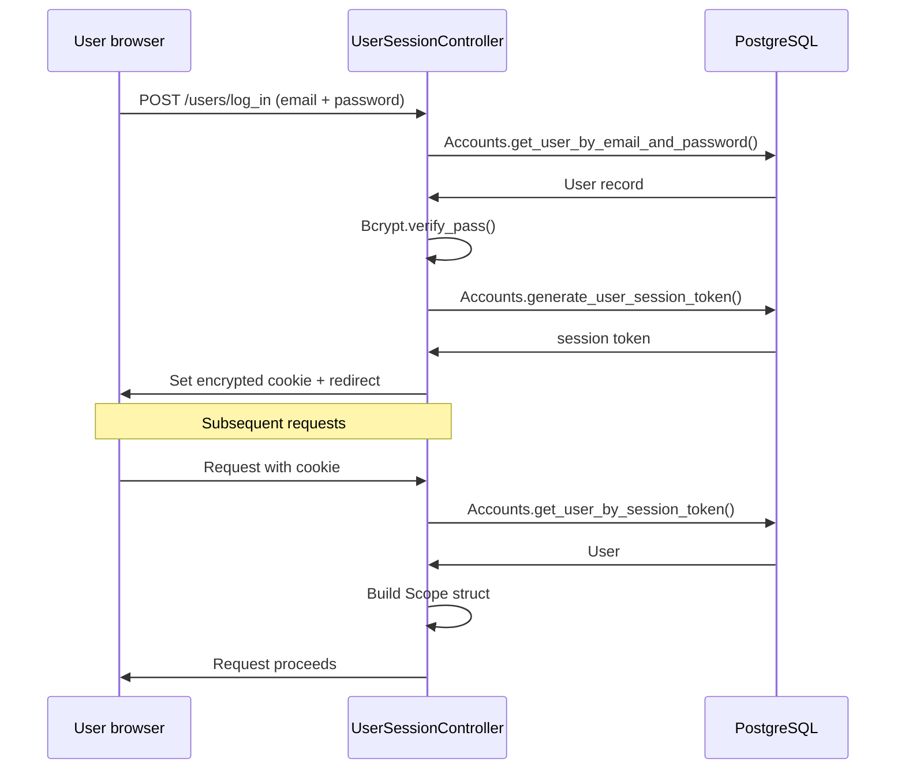

#### Role-Based Access

There are three roles. Every request passes through a `Scope` struct that carries the current user and their client context.

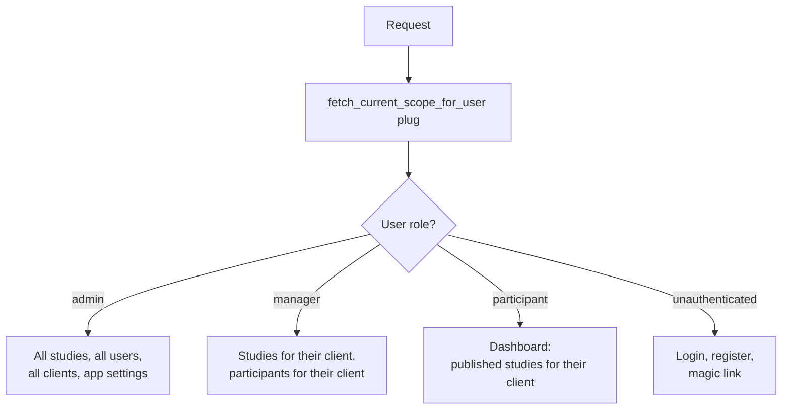

#### Study Access Guard

When a participant loads a study, `StudyController` verifies their client matches the study's client before serving the page:

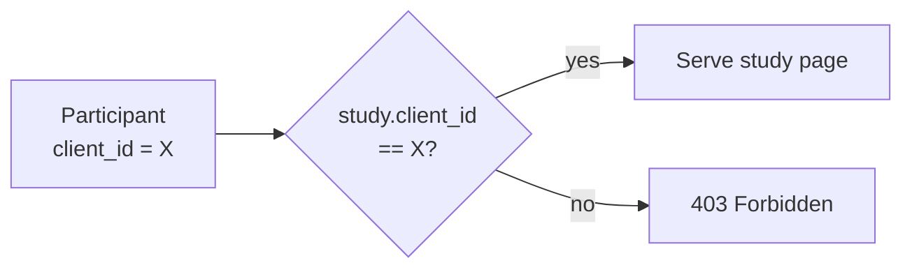

---

### Data Export

After a study runs, submissions are stored as raw jsPsych event arrays. Socho can export them as a flat CSV.

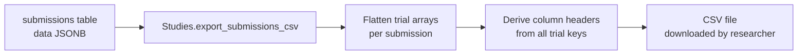

Each row in the CSV is one submission. Columns are derived from the union of all jsPsych event keys across all submissions (e.g. `rt`, `response`, `stimulus`, `trial_type`). Trial-level columns are prefixed by trial index when a submission has multiple trials.

---

## Frontend & JavaScript Interop

### LiveView Hooks

Hooks connect DOM elements to JavaScript behaviour while letting the server stay in control of state. The main hooks in use:

| Hook | File | Purpose |
|------|------|---------|
| `Sortable` | `sortable_hook.js` | Drag-and-drop reordering of trials in the builder tree |
| `.SurveyHtml` | (colocated in component) | TipTap rich text editor for survey question titles; pushes `sq_update_field` events to the server on blur |

### phx-update="ignore"

The TipTap editor elements use `phx-update="ignore"` so LiveView does not overwrite the editor's DOM on re-renders. The editor is initialised once by the hook and manages its own DOM. Data flows back to the server via `phx-hook` push events, not by LiveView patching the element.

### jsPsych ↔ Socho Communication

jsPsych runs completely independently of LiveView. The only communication between jsPsych and the Phoenix backend is a single HTTP POST at the end of the study:

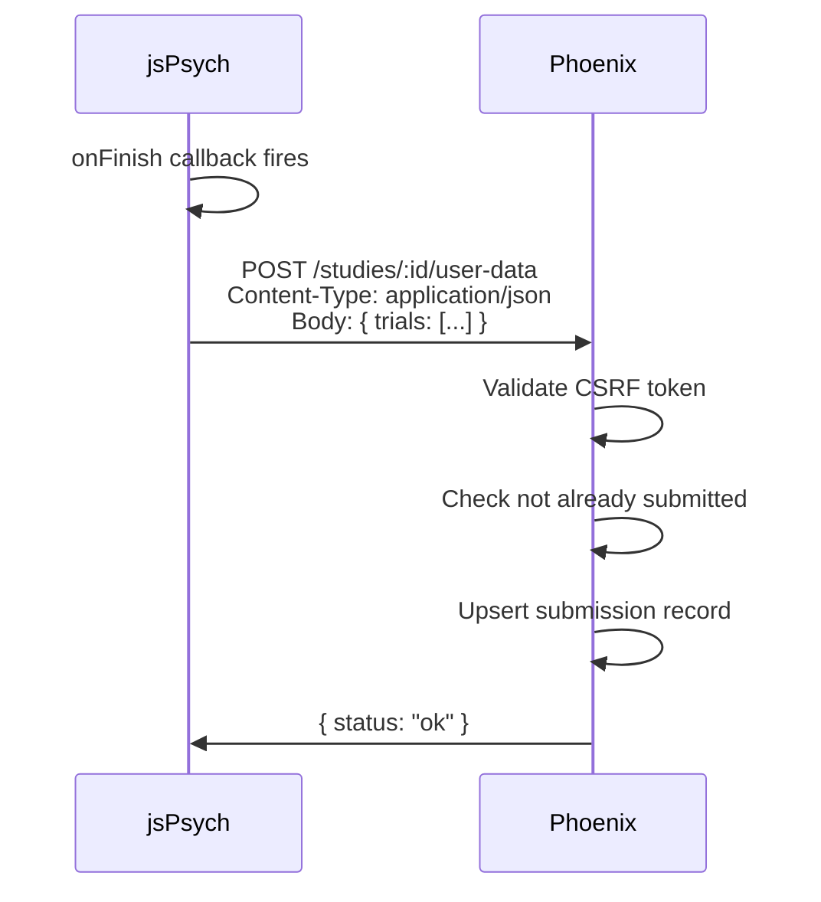
