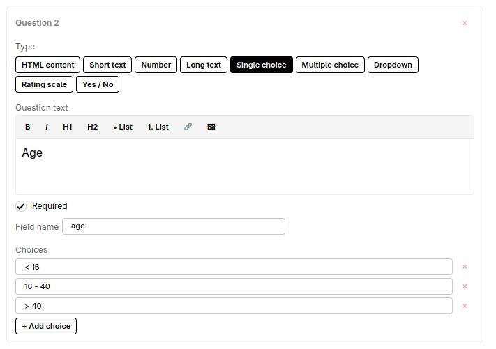
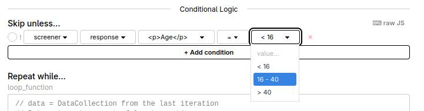

# User Guide: Building a Conditional Study in Socho

## Overview

This guide walks you through building a study that shows different content based on how a participant answers a survey question. Specifically, you will build a screener survey that asks for age, then routes participants to a different screen depending on which age group they select.

The technique relies on two features working together:

- A **tag** on the survey block, which gives it a name the rest of the study can reference.
- **Skip unless conditions** on each timeline group, which tell the builder "only run this block if a specific answer was given."

---

## Phase 1: Create the Survey Block

### Step 1: Add a survey block

In the top area of the screen, you will see a row of plugin buttons. Find the button labelled **survey** and click it.

A new block will appear in **Column 1** (the trial tree on the left). It will be selected automatically, and its configuration will appear in **Column 2** (the middle panel).

### Step 2: Add the Name question

In Column 2, find the **Add Question** button inside the survey builder and click it.

1. **Name field:** `name`
2. **Type dropdown:** `text`

### Step 3: Add the Age question

Click **Add Question** again.

1. **Name field:** `age`
2. **Type dropdown:** `radiogroup`
3. **Required toggle:** Turn it on — this question drives the branching logic.
4. **Choices:** Add the following 3 choices:
   
   - < 16
   - 16-40
   - > 40
   


### Step 4: Add the Gender question

Click **Add Question** again.

1. **Name field:** `gender`
2. **Type dropdown:** `radiogroup`
3. **Choices:**
   ```
   Male
   Female
   Non-binary
   Prefer not to say
   ```

### Step 5: Tag the survey block

Scroll to the bottom of Column 2. Find the **Identification** section and its **Tag** (`data.tag`) field. Type: `screener`

**Why this matters:** The tag is how the timeline groups refer back to this survey. Without it, the skip-unless condition dropdowns won't show this survey or its questions. The app will show the tag in condition dropdowns only after it's set and saved.

Click **Save**.

---

## Phase 2: Timeline Group 2 — "Adult" (age <16)

### Step 6: Add a Timeline Group

Click **+ Timeline Group** in the top area. A new group appears in Column 1. Click it to select it.

### Step 7: Add a trial inside the group

With the timeline group selected, click **html-button-response** in the plugin strip. This adds a trial *inside* the selected group. In Column 2, set the **stimulus** field to:

```
You selected: < 16
```

### Step 8: Set the Skip Unless condition



Click the **timeline group** node in Column 1 (not the trial inside it). Scroll to **Conditional Logic** in Column 2 and click **+ Add condition**.

| Control | Select |
|---------|--------|
| Tag dropdown | `screener` |
| Field dropdown | `response` |
| Question dropdown *(appears for survey tags)* | `age` |
| Operator dropdown | `=` |
| Value dropdown *(automatically populated with the exact choices from the survey — just pick from the list)* | `< 16` |

**In plain English:** This group runs only when the participant chose "< 16" for age. Anyone else skips it.

Click **Save**.

---

## Phase 3: Timeline Group 2 — "Adult" (age 16-40)

### Step 9–11: Same pattern

Add another **+ Timeline Group**. Inside it, add an **html-button-response** with stimulus:

```
You selected: 16-40
```

Select the timeline group and add a condition:

| Control | Select |
|---------|--------|
| Tag | `screener` |
| Field | `response` |
| Question | `age` |
| Operator | `=` |
| Value dropdown *(automatically populated with the exact choices from the survey — just pick from the list)* | `16-40` |

Click **Save**.

---

## Phase 4: Timeline Group 3 — "Senior" (age > 40)

### Step 12–14: Same pattern

Add another **+ Timeline Group**. Inside it, add an **html-button-response** with stimulus:

```
You selected: > 40
```

Select the timeline group and add a condition:

| Control | Select |
|---------|--------|
| Tag | `screener` |
| Field | `response` |
| Question | `age` |
| Operator | `=` |
| Value dropdown *(automatically populated with the exact choices from the survey — just pick from the list)* | `> 40` |

Click **Save**.

---

## Phase 5: Verify

### Step 15: Check the trial tree

Column 1 should show:

- `survey` block (ungrouped)
- Timeline Group → `html-button-response`
- Timeline Group → `html-button-response`
- Timeline Group → `html-button-response`

### Step 16: Check each condition

Click each timeline group and confirm its condition in **Conditional Logic**. If anything is wrong, click **✕** on the condition row to remove it and re-add it.

### Step 17: Preview

Click **Preview** in the top bar and run through the survey. Select each age option in turn — only the matching timeline group should appear after the survey.

---

## How It Works

When a participant runs the study:

1. The **survey block** is presented. All answers are stored internally under the tag `screener`.
2. The study reaches **Timeline Group 1**. Before running it, the app checks: "does the `screener` survey's `age` answer equal `< 16`?" If yes, the group runs. If no, it is silently skipped.
3. The same check happens for Groups 2 and 3 with their respective values.

Because exactly one age choice must have been selected, exactly one timeline group will run. The participant sees a seamless flow: survey → the one screen matching their answer.
