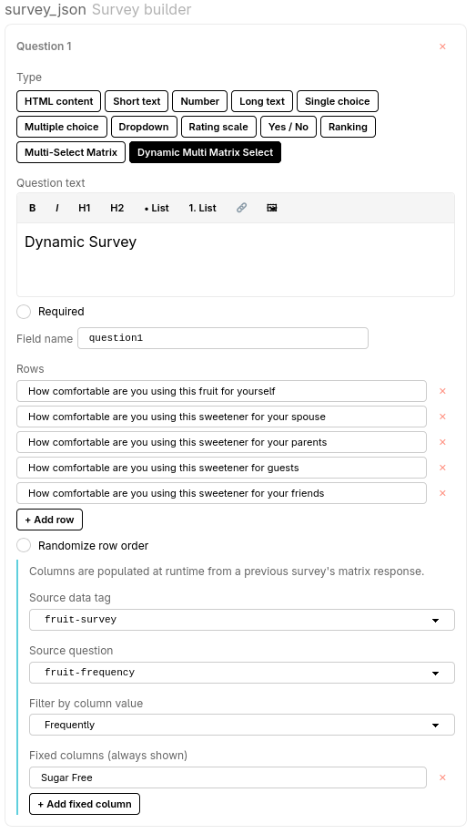

# User Guide: Dynamic Multi-Select Matrix

## Overview

Sometimes the questions you want to ask a participant depend on how they answered an earlier question. A common example: you first ask participants which fruits they consume *daily*, and then — in a follow-up survey — you want to ask detailed questions about *only those fruits*, not every fruit on your list.

Without this feature, you would have to create a separate survey for every possible combination of responses, which is impractical. The **Dynamic Multi-Select Matrix** question type solves this by reading the participant's previous answers at runtime and building the matrix columns on the fly.

---

## Functional Requirements

### Terminology

- **Source survey** — The earlier survey from which dynamic column values are derived. It contains a standard matrix question whose rows are items (e.g. fruits) and whose columns represent values on a scale (e.g. *Daily, Frequently, Rarely, Never* or *Strongly Agree, Agree, Neutral, Disagree, Strongly Disagree*).
- **Dynamic survey** — The follow-up survey that contains the Dynamic Multi-Select Matrix question. Its columns are built at runtime from the participant's responses to the source survey.

---

### Column Selection Rules

1. **Always filter by the first column of the source survey.**
   The system does not ask the study designer to choose a filter column. It always uses the first column (index 0) of the source survey's matrix as the primary filter — for example, *Daily* or *Strongly Agree*.

2. **Treat source survey columns as an ordered scale.**
   Columns are assumed to be arranged from highest to lowest priority (e.g. *Daily > Frequently > Rarely > Never*). When determining which items become dynamic columns, the system works through the scale from left to right.

3. **Fall back to the next scale value when the first column yields no results.**
   If a participant has not selected any items under the first column value, the system moves to the second column value and checks those items. It continues down the scale until it finds at least one item or exhausts all columns.

4. **Cap dynamic columns at 4.**
   The system collects at most 4 items to use as dynamic columns, filling the quota by moving through the scale in order:
   - Start with all items the participant selected under column 1 (primary filter).
   - If fewer than 4 have been collected, add items from column 2, then column 3, and so on, until the cap of 4 is reached.

5. **Shuffle before displaying.**
   Once up to 4 items have been collected from the scale, they are shuffled into a random order before being shown to the participant. This prevents the column order from implying any ranking.

6. **Fixed columns are prepended before dynamic columns.**
   Any fixed columns configured by the study designer are always shown and appear before the (shuffled) dynamic columns, bringing the total column count above 4 if fixed columns are present.

---

### Configuration

| Setting | Purpose |
|---------|---------|
| **Source data tag** | Identifies the source survey block by its tag. Must match the tag set in that block's Identification section exactly (case-sensitive). |
| **Source question** | The field name of the matrix question inside the source survey whose responses drive the dynamic columns. |
| **Fixed columns** | Column labels that always appear for every participant, appended after the dynamic columns. |

> **Note:** There is no "Filter by column value" setting. The first column of the source survey is always used as the primary filter.

---

## How It Works

The study has two surveys:

1. **Survey 1 (the source)** — A standard matrix question where participants mark their fruit consumption frequency. This is a regular **Multi-Select Matrix** or single-select matrix. Each row is a fruit; each column is a frequency.

2. **Survey 2 (the dynamic one)** — Contains a **Dynamic Multi-Select Matrix** question. When this survey runs, Socho reads the participant's response from Survey 1 and uses only the fruits they marked as "Daily" (or whichever column you choose) as the column headers.

The participant never sees the machinery — they just see a matrix whose columns are personalised to their own prior responses.

---

## Step-by-Step Walkthrough

### Part 1: Set Up the Source Survey

1. Add a **survey** block to your study. Give it a meaningful name, for example **Fruit Frequency Survey**.

2. In the **Identification** section at the bottom of the config panel, set a **Tag** on this block — for example `fruit-survey`. This tag is how the second survey finds this block's data at runtime.

3. Inside the survey builder, click **+ Add question** and choose **Multi-Select Matrix**.

4. Set the **Field name** to something clear, for example `fruit-frequency`.

5. Add the following **Rows** (one per fruit):

   | Row label |
   |-----------|
   | Orange |
   | Apple |
   | Banana |
   | Guava |
   | Pear |
   | Strawberries |

6. Add the following **Columns** (consumption frequencies):

   | Column label |
   |--------------|
   | Daily |
   | Frequently |
   | Rarely |
   | Never |

7. Mark the question **Required** if every participant must answer it.

The participant will see a grid where they can check one or more frequency values for each fruit.

---

### Part 2: Set Up the Dynamic Survey

1. Add a second **survey** block after the first one. Name it something like **Follow-up: Daily Fruits**.

2. Inside the survey builder, click **+ Add question** and choose **Dynamic Multi Matrix Select**.

3. Set the **Field name**, for example `daily_fruit_followup`.

4. Add **Rows** — these are the questions you want to ask about each fruit the participant consumes daily:

   | Row label |
   |-----------|
   | How likely are you to use this fruit for yourself |
   | How likely are you to use this fruit for your spouse |
   | How likely are you to use this fruit for your parents |
   | How likely are you to use this fruit for your guests |
   | How likely are you to use this fruit for your friends |

5. In the **Dynamic column source** section, configure the three fields:

   | Field | Value |
   |-------|-------|
   | **Source data tag** | `fruit-survey` ← the tag you set on Survey 1 |
   | **Source question** | `fruit-frequency` ← the field name of the matrix question |
   | **Filter by column value** | `Daily` ← only fruits marked Daily become columns |

   These dropdowns are populated from the tagged blocks already in your study, so they only show valid options once Survey 1 has a tag and has been saved.

6. In the **Fixed columns (always shown)** section, click **+ Add fixed column** and type:

   ```
   Orange
   ```

   This column will appear for every participant regardless of which fruits they selected.

7. Optionally mark the question **Required** to enforce that participants fill every row.



---

### Part 3: How the Participant Experiences It

Suppose a participant goes through Survey 1 and checks **Daily** for Orange, Apple, and Strawberries (and other frequencies for the rest).

When Survey 2 runs, Socho reads that participant's data, finds the rows where the `Daily` column was selected, and builds the matrix columns as:

```
Orange | Apple | Strawberries | Banana
```

The participant then sees a 5 × 4 matrix (5 rows of likelihood questions, 4 columns for their daily fruits plus the fixed Sugar Free column).

A participant who checked only Banana as Daily would see:

```
Banana | Orange
```

Every participant sees a matrix that reflects their own answers — no one is asked about fruits they don't eat daily.

---

## Configuration Reference

| Setting | Purpose |
|---------|---------|
| **Rows** | The questions or statements shown on the left of the matrix. These are the same for every participant. |
| **Source data tag** | The tag of the earlier survey block whose data should be read. Must match the **Tag** set in that block's Identification section. |
| **Source question** | The **Field name** of the matrix question inside the source survey. |
| **Filter by column value** | Only rows where the participant selected this column value become dynamic columns. |
| **Fixed columns** | Column labels that always appear, regardless of the participant's answers. Added after the dynamic columns. |

---

## Things to Keep in Mind

**The source survey must run first.** The dynamic matrix reads data that has already been collected. If the participant reaches Survey 2 without completing Survey 1, the dynamic columns will be empty and only the fixed columns will appear.

**Tags must be exact.** The tag in the Identification section of the source block and the value you enter in **Source data tag** must match character for character, including case.

**Fixed columns always appear last.** Dynamic columns (the fruits filtered from the source) come first, followed by any fixed columns you added.

**This is an experimental feature.** The Dynamic Multi-Select Matrix is designed for specific personalised workflows. It may be revised or replaced in a future version of Socho.
